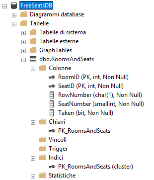

# Free Seats sample application

The exercise consists to develop a sample VCL application, using Delphi language, to solve the "free seats" problem that is described in the technical specifications section. The VCL sample application must be done using Model-View-Presenter design pattern that allows you to separate different responsabilities, implementing the View, the Model and the Presenter.

Technical specifications
========================

There is a group of people whose number is defined, the Free Seats sample application is able find in what row of a room in a cinema or theater there is enough space for these people to have all the nearby seats. Regarding the "free seats" algorithm, set-based solutions are preferred because today our cinema has one room with twelve rows with forty seats each, but tomorrow it will have ten rooms with twenty rows with fifty seats each :)

The following picture shows a sample scenario for a room in our cinema.

The *input* consists of the number of people who want to buy a carnet of tickets for a particular movie in our cinema or for a theater show. The *output* consists of the coordinates where the group of people can find the exact number of the nearby free seats in the room where the show will be done.

Free Seats database
===================

The Free Seats sample application works with *FreeSeatsDB* that is hosted on a SQL Server instance running on SQL Azure. You should have already received the credentials for connecting to SQL Azure. The main table in the *FreeSeatsDB* is *dbo.RoomsAndSeats*. The following picture shows the schema of the table *dbo.RoomsAndSeats*.

Goals to achieve
================

- Connect to Azure SQL Database through Delphi data access components
- Understand the Model View Presenter (M-V-P) design pattern
- Set-based thinking (T-SQL)

Enjoy the Free Seats application!
